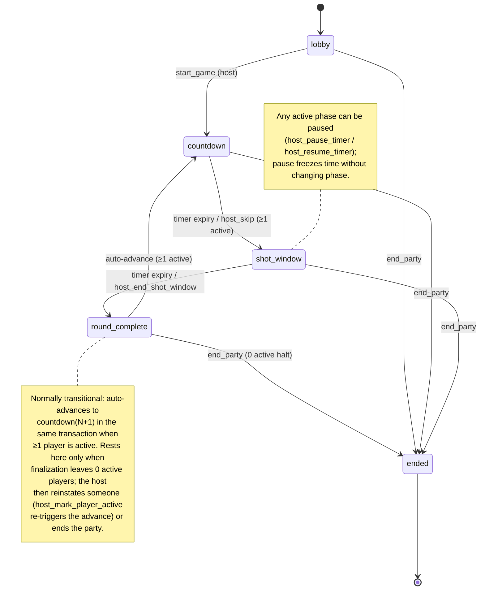

# MVP State Machine

> The formal state machine for a Shot O'Clock party session in MVP scope.
> Defines all phases, all legal transitions, all triggers, all invariants.
> When this doc and code disagree, the doc wins until the doc is amended.
> Cross-reference: `game-rules.md` for what player actions *do*; this doc for *when* they are allowed.

---

## 1. Scope

This spec covers the MVP party lifecycle. The phases `referee_confirmation` and `host_review` exist in the schema enums (see `docs/specs/enums.md`) but are out of MVP scope and are not implemented.

The session is modeled as a state machine. State lives on the `party_sessions` row:

- `status`: lobby | active | paused | ended | expired | cancelled
- `currentPhase`: lobby | countdown | shot_window | round_complete | ended
- `phaseStartedAt`: timestamp
- `phaseEndsAt`: timestamp (null in lobby, round_complete, and ended)
- `currentRoundNumber`: int

A session's "state" is the tuple `(status, currentPhase)`. Most of the work in MVP happens in the `status=active` substates.

**Naming note:** the schema phase is `round_complete`. The user-facing screen that displays this phase is called "Round Results" in the wireframes. Both refer to the same state.

---

## 2. Status vs Phase

`status` is the coarse state:

- `lobby` — pre-game, players can join, no rounds yet
- `active` — game in progress, currently in some `currentPhase`
- `paused` — frozen by host, will resume in current phase
- `ended` — host ended manually, terminal
- `expired` — auto-closed after inactivity, terminal (post-MVP)
- `cancelled` — host cancelled before starting, terminal (post-MVP)

`currentPhase` is meaningful only when `status ∈ {active, paused}`. In `lobby` status, phase is also `lobby`. In `ended` status, phase is also `ended`. Storing both is redundant but makes queries simpler; both must stay in sync.

---

## 3. Phases

### 3.1. `lobby`

Pre-game. Host has created the party but not started it. Players can join and leave freely.

State shape:
- `status` = `lobby`
- `currentPhase` = `lobby`
- `phaseStartedAt` = party creation time
- `phaseEndsAt` = null
- `currentRoundNumber` = 0

Allowed actions:
- `join_party` (any guest with a valid join code, if `isLocked = false`)
- `host_remove_player`
- `start_game` (host only, requires at least 1 player including host)
- `end_party` (host only — cancels the party before it starts)
- Players can leave (marks them `status = removed` for this session)

Forbidden:
- Anything that depends on a round (mark_done, mark_self_out, host_add_time, etc.)

### 3.2. `countdown`

A round is scheduled. Time is ticking down toward the shot window.

State shape:
- `status` = `active`
- `currentPhase` = `countdown`
- `phaseStartedAt` = when countdown started
- `phaseEndsAt` = `phaseStartedAt + roundIntervalSeconds`
- `currentRoundNumber` = N (the round about to happen)

Allowed actions:
- `mark_self_out` — player opts out before the shot; recorded with `playerAction = self_out` for round N
- `host_pause_timer`
- `host_add_time`
- `host_skip_to_shot_window` (immediately ends countdown, enters `shot_window`)
- `host_remove_player`
- `host_mark_player_out` / `host_mark_player_active`
- `end_party`
- `advance_phase_if_due` — system call; if `now() >= phaseEndsAt`, transitions to `shot_window`

Forbidden:
- `mark_done` (no shot is happening yet)

### 3.3. `shot_window`

Shot is happening NOW. Players have until `phaseEndsAt` to mark Done.

State shape:
- `status` = `active`
- `currentPhase` = `shot_window`
- `phaseStartedAt` = when shot window opened
- `phaseEndsAt` = `phaseStartedAt + shotWindowSeconds`
- `currentRoundNumber` = N

Allowed actions:
- `mark_done` — active players only, before `phaseEndsAt`
- `mark_self_out`
- `host_pause_timer`
- `host_add_time`
- `host_end_shot_window` — immediately transitions to `round_complete`
- `host_remove_player`
- `host_mark_player_out` / `host_mark_player_active`
- `end_party`
- `advance_phase_if_due` — system; if `now() >= phaseEndsAt`, transitions to `round_complete`

Forbidden:
- `mark_done` from non-active players

### 3.4. `round_complete`

The shot window is closed and round N's outcomes have been finalized. Under the
auto-advance model (D014) this phase is normally **transitional**: inside the same
finalizing transaction the session immediately advances to `countdown` for round
N+1 whenever at least one player is still `active`. The session only *rests* in
`round_complete` when finalization leaves **zero active players** — the halt state
in §8.1 and `game-rules.md` §9.5.

State shape (resting case — zero active players):
- `status` = `active`
- `currentPhase` = `round_complete`
- `phaseStartedAt` = when round_complete began
- `phaseEndsAt` = null (no timer)
- `currentRoundNumber` = N (the round just finalized)

Allowed actions (resting case):
- `host_mark_player_active` — reinstating a player re-triggers the auto-advance into
  `countdown` for round N+1 (see `rpc-contracts.md` §11.1; implemented in Batch E)
- `host_mark_player_out`
- `end_party`

Forbidden:
- Player actions on round N (round is finalized; outcomes are now read-only)
- `mark_done` (no active shot)
- `advance_phase_if_due` (this phase has no timer)

### 3.5. `ended`

Party is over. Read-only.

State shape:
- `status` = `ended`
- `currentPhase` = `ended`
- `endedAt` = timestamp

Allowed actions:
- Read-only queries of the session, players, rounds, outcomes (subject to RLS)

Forbidden:
- Everything that mutates session, player, or round state

---

## 4. Paused as a Meta-State

Pause does not change `currentPhase`. It freezes time.

When `host_pause_timer` is called:
- `status` changes to `paused`
- `pausedAt` is set to current time
- Remaining time `(phaseEndsAt - pausedAt)` is preserved logically (no `phaseEndsAt` mutation yet)

When `host_resume_timer` is called:
- `status` changes back to `active`
- `phaseEndsAt` is recomputed as `now() + remainingTime`
- `totalPausedSeconds` is incremented by `(now() - pausedAt)`
- `pausedAt` is cleared

Allowed while paused:
- `host_resume_timer`
- `host_add_time` (extends `remainingTime` rather than `phaseEndsAt` directly)
- `host_remove_player`
- `host_mark_player_out` / `host_mark_player_active`
- `end_party`
- `mark_self_out` (safety always available)

Forbidden while paused:
- Phase transitions (`advance_phase_if_due` is a no-op)
- `mark_done`

---

## 5. Transition Table

| From phase | To phase | Trigger | Who | Key side effects |
|---|---|---|---|---|
| lobby | countdown | `start_game` | host | Create round 1; set phase = countdown; set `phaseEndsAt` = `now()` + `startingIntervalSeconds` |
| countdown | shot_window | timer expiry via `advance_phase_if_due` | system | Set phase = shot_window; set `phaseEndsAt` = `now()` + `shotWindowSeconds`; set `shotWindowStartedAt` on round |
| countdown | shot_window | `host_skip_to_shot_window` | host | Same as above |
| shot_window | round_complete → countdown(N+1) | timer expiry via `advance_phase_if_due` | system | Finalize round N per `game-rules.md` §7 (via `finalize_round_outcomes`); mark round completed; log `round_completed`. Then if ≥1 active player remains: increment round number, compute next interval (`prevInterval + intervalIncrementSeconds`, clamped at `maxIntervalSeconds` if set), create round N+1, set phase = countdown, `phaseEndsAt` = `now()` + interval, log `next_round_started`. If 0 active remain: rest in `round_complete`. |
| shot_window | round_complete → countdown(N+1) | `host_end_shot_window` | host | Same finalize + auto-advance via the shared `finalize_round_outcomes` helper. `round_completed` carries `triggeredBy = host`; `next_round_started` is `system`. |
| round_complete (resting, 0 active) | countdown(N+1) | `host_mark_player_active` re-triggers advance | host → system | Reinstating a player when none are active resumes the loop with the same auto-advance side effects. |
| any active phase | paused | `host_pause_timer` | host | Set status = paused; record `pausedAt` |
| paused | active (resume same phase) | `host_resume_timer` | host | Set status = active; recompute `phaseEndsAt`; increment `totalPausedSeconds` |
| any | ended | `end_party` | host | Set status = ended; currentPhase = ended; `endedAt` = `now()` |

---

## 6. Idempotency

These functions must be idempotent — calling them twice in the same moment must produce the same end state as calling them once:

- `start_game` — if already started, return current state; do not re-create round 1
- `advance_phase_if_due` — if phase has already advanced, no-op
- auto-advance (within `finalize_round_outcomes`) — finalization is gated by `round.completedAt`; round N+1 creation is gated by the `(party_session_id, round_number)` unique constraint. Calling `advance_phase_if_due` twice yields one finalization and one round N+1.
- `mark_done` — if already marked done for this round, no-op (return existing outcome)
- `mark_self_out` — if already self-out for this round, no-op
- `end_party` — if already ended, no-op
- `host_pause_timer` — if already paused, no-op
- `host_resume_timer` — if not paused, no-op

Idempotency keys: use `(party_session_id, round_number)` for round-scoped functions and `(round_id, party_player_id)` for outcome-scoped functions. Enforce with unique constraints in addition to function-level checks. **Both layers are required** — DB constraints catch the race, function checks give a clean response.

---

## 7. Forbidden Transitions

Any function attempting one of these must return an error with code `ILLEGAL_TRANSITION`:

- `shot_window → countdown` (cannot rewind to before the shot)
- `round_complete → shot_window` (cannot replay a finalized round)
- `ended → anything` (terminal)
- `lobby → shot_window` directly (must pass through countdown — even if `startingIntervalSeconds` is 0, create the countdown phase briefly so the state machine stays consistent)
- Direct transitions skipping finalization (every round must be finalized — passing through `round_complete` — before round N+1 is created, even though the two steps are now atomic)
- Round N+1 being created before round N's outcomes are finalized
- Any host-only transition triggered by a non-host

---

## 8. Edge Cases

### 8.1. No active players when shot_window would begin

If all players are `status ∈ {out, removed}` at the moment `countdown → shot_window` would fire, transition is rejected with error code `NO_ACTIVE_PLAYERS`. The session remains in `countdown` (paused or not), and the host must intervene — either reinstating someone or ending the party. The client should show a clear message.

### 8.2. All active players opt out during countdown

Same as 8.1 — once active count hits zero, the transition into `shot_window` is blocked. Host decides next.

### 8.3. Host disconnects mid-game

Session state is durable. System-triggered transitions (`advance_phase_if_due`, including the auto-advance into the next round) do not need the host. Host-only actions (`host_end_shot_window`, `host_skip_to_shot_window`, the host timer controls, etc.) wait until the host returns. Host transfer is post-MVP; for MVP, this is a known limitation, surfaced to the host as a warning in the UI.

### 8.4. Double-tap on `mark_done`

Both calls succeed at the function level, but only one outcome row exists, enforced by a unique constraint on `(round_id, party_player_id)` and the upsert pattern in the RPC. The second call returns the existing outcome row.

### 8.5. `mark_done` followed by `mark_self_out` in the same shot window

`mark_self_out` overrides. See `game-rules.md` §3.3.

### 8.6. Host pauses during `round_complete`

`round_complete` has no timer, so pausing is logically a no-op. MVP behavior: **accept the call** (sets `status = paused`) for consistency with other phases. `advance_phase_if_due` is already a no-op in this phase. Host actions remain available.

### 8.7. Clock skew between client and server

Clients display timer based on server-provided `phaseEndsAt`. All authoritative transitions key off the server's clock via `now()` in SQL. Accept ~1s display drift on the client. Do not have the client send its local time to the server.

### 8.8. Concurrent `host_pause_timer` calls from two host sessions

Only one host exists in MVP, but the host may have multiple tabs/devices. Use the function-level idempotency check (§6): second call returns the already-paused state without changing anything. No race-induced double-pause.

### 8.9. `advance_phase_if_due` called twice in the same millisecond

DB-level idempotency: finalization is gated by `round.completedAt`, and the `(party_session_id, round_number)` unique constraint on `rounds` ensures the auto-advance creates only one round N+1. The first call finalizes + advances; the second sees the round already completed (and/or `now() < phaseEndsAt` in the new countdown) and returns `transitioned = false`.

---

## 9. Visual

---

## 10. Locked Decisions

- Rounds auto-advance: `shot_window → round_complete → countdown(N+1)` happens atomically inside the finalizing RPC (`finalize_round_outcomes`); there is no manual host gate between rounds and no `start_next_round` RPC (D014). The sole exception is the zero-active-players halt (§3.4, §8.1).
- `mark_self_out` during countdown records an outcome for round N (the upcoming shot), not N-1.
- Removing a player does NOT clear their existing round outcomes — history is preserved.
- Host pausing mid-shot-window does NOT invalidate already-recorded player actions; only new actions are blocked until resume.
- When the last active player goes out, the session does NOT auto-end. It rests in `round_complete`; the host reinstates someone (which re-triggers the auto-advance) or ends the party.

---

## 11. Open Questions

(None currently. When new questions arise during implementation, add them here and flag in the next prompt.)
